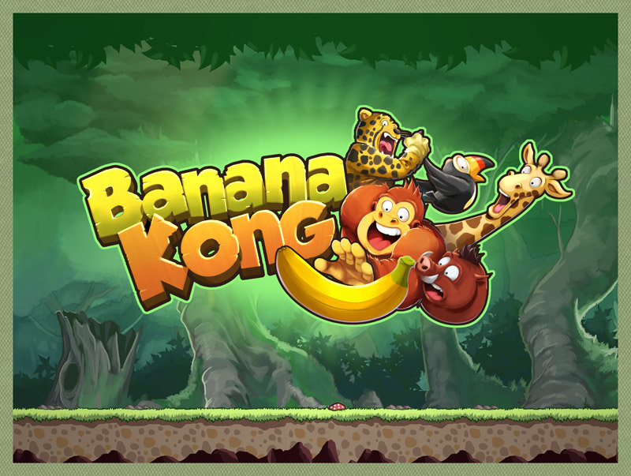
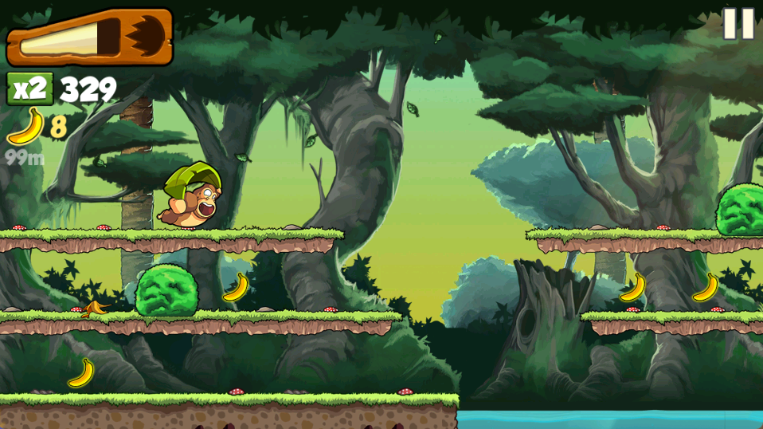
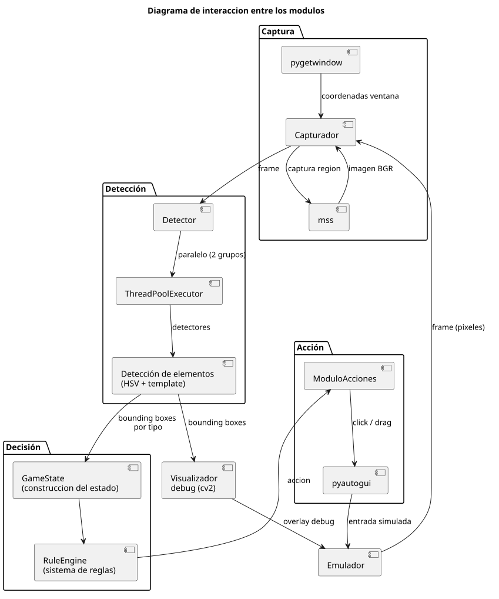
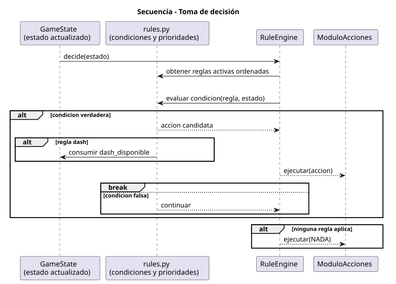
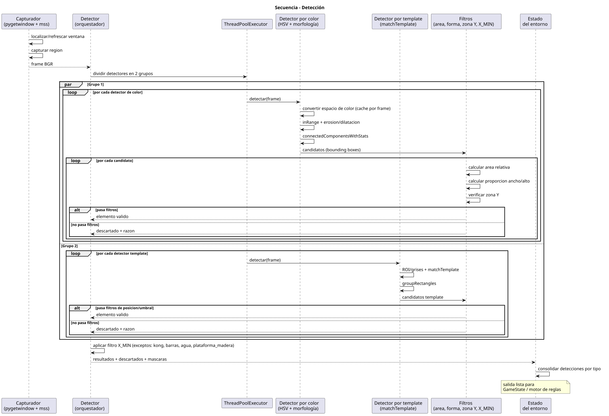
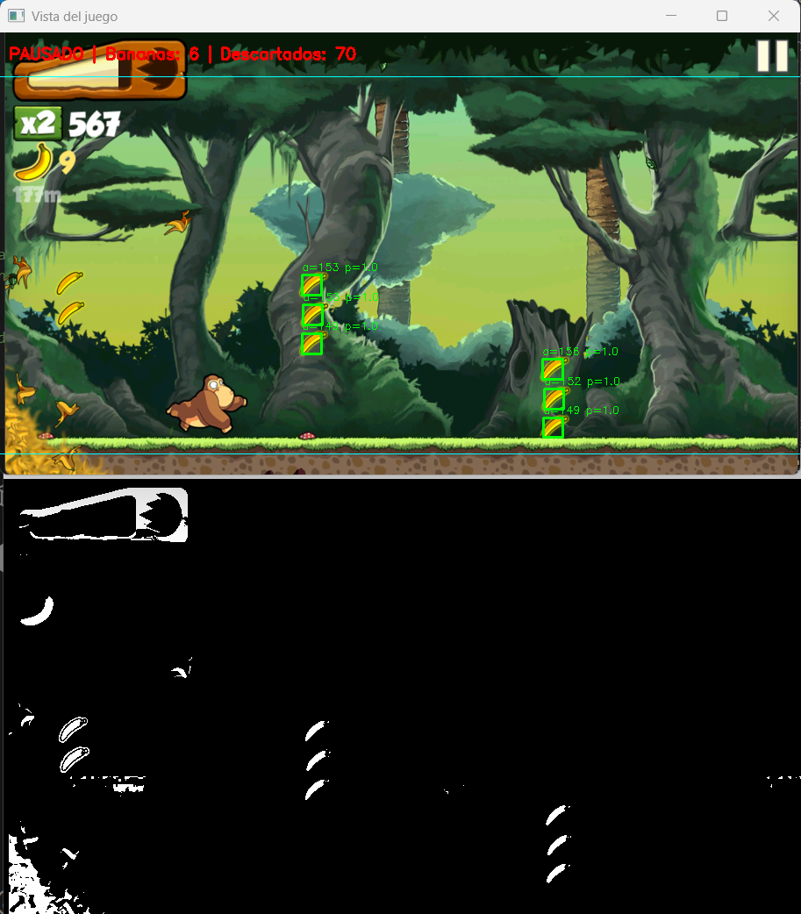
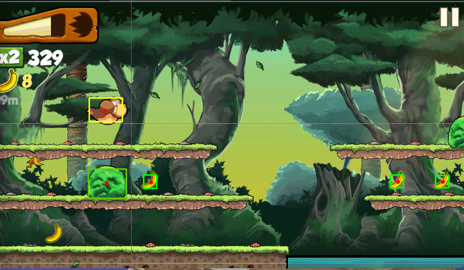
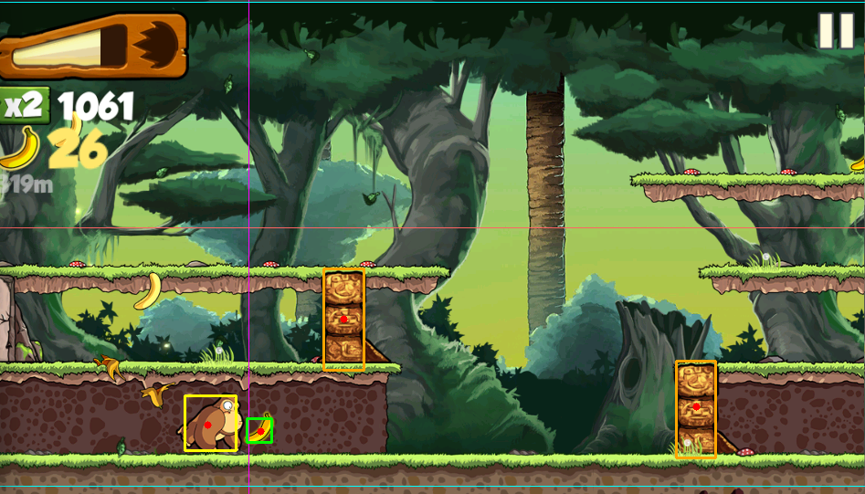

# BananaBot: sistema autonómo para banana kong con reglas predefinidas

## 1. Introducción

En los videojuegos modernos, la toma de decisiones ocurre en tiempo real y está basada en información visual presentada en pantalla. Automatizar la ejecución de un videojuego sin acceso interno al motor del juego representa un desafío técnico significativo, ya que el sistema debe interpretar el estado del juego únicamente a partir de los píxeles capturados en cada frame.

Este proyecto propone el diseño e implementación de un bot autónomo capaz de percibir el estado del juego mediante captura de pantalla en tiempo real, interpretar información relevante usando técnicas de visión por computador, tomar decisiones automáticamente mediante un sistema de reglas predefinidas, y ejecutar acciones simulando entradas de teclado.

El sistema opera bajo un enfoque black-box visual, es decir, sin acceso a memoria interna, sin modificación del cliente del juego y sin uso de APIs propietarias del mismo. El videojuego seleccionado es Banana Kong, un juego de plataformas móvil con desplazamiento lateral continuo, que presenta una estructura visual relativamente consistente y elementos claramente diferenciables por color y forma.

## 2. Marco conceptual

### 2.1 Visión por Computador Clásica

La visión por computador clásica, también denominada **procesamiento digital de imágenes tradicional**, se fundamenta en análisis directo de propiedades visuales de píxeles tales como color, bordes, contornos y textura. A diferencia de enfoques basados en redes neuronales profundas, no requiere:

- Conjuntos de datos etiquetados masivos para entrenamiento
- Infraestructura computacional intensiva (GPUs)
- Tiempos de entrenamiento prolongados

Las principales técnicas empleadas en este proyecto incluyen:

#### 2.1.1 Espacios de Color

- **HSV (Hue, Saturation, Value):** Descompone una imagen en componentes de color puro (Hue), intensidad de color (Saturation) e intensidad luminosa (Value). Es más robusto a cambios de iluminación que RGB, lo que lo hace especialmente útil para escenas con variabilidad lumínica.
- **Segmentación por rango:** Define un rango [mín, máx] en el espacio HSV y clasifica píxeles dentro del rango como positivos (elemento detectado) y fuera del rango como negativos (fondo).

#### 2.1.2 Operaciones Morfológicas

- **Erosión:** Reduce áreas blancas (positivas) en la máscara binaria, eliminando ruido pequeño.
- **Dilatación:** Expande áreas blancas, cerrando agujeros pequeños y conectando regiones cercanas.
- **Apertura (erosión + dilatación):** Remueve ruido manteniendo la estructura general.
- **Cierre (dilatación + erosión):** Cierra pequeños agujeros dentro de objetos.

#### 2.1.3 Análisis de Contornos

Tras segmentación, se extraen contornos (frontera entre objeto y fondo) y se calculan propiedades geométricas:

- **Área:** Cantidad de píxeles del objeto
- **Proporción alto/ancho (aspect ratio):** Describe la forma (cuadrado, rectangular, vertical)
- **Centroide:** Centro geométrico del objeto
- **Bounding box:** Rectángulo envolvente

#### 2.1.4 Template Matching

Compara una imagen de referencia (template) contra una imagen grande, deslizando el template en todos los puntos posibles y calculando una métrica de similitud (correlación, diferencia cuadrada). Útil para objetos con forma distintiva pero tamaño variable.

### 2.2 Sistemas Autónomos y Visión en Tiempo Real

Un sistema autónomo es aquel capaz de tomar decisiones e interactuar con su entorno sin intervención humana constante. En el contexto de videojuegos, el sistema autónomo debe:

1. **Percibir** el entorno mediante captura y análisis visual
2. **Interpretar** la información percibida en una representación interna (estado del juego)
3. **Decidir** la acción óptima según el estado
4. **Actuar** ejecutando la decisión sobre el entorno (controles)

La constraint de **tiempo real** implica que todo el pipeline (percepción → decisión → acción) debe completarse dentro de una ventana temporal compatible con la dinámica del juego. Para videojuegos típicos:

- **Tasa de refresco:** 30 – 60 FPS → ~33 ms a ~16 ms por frame
- **Latencia máxima permitida:** ~100 ms (3 frames) sin degradación notable en desempeño

### 2.3 Sistemas de Reglas Predefinidas

Un sistema de decisión basado en reglas utiliza un conjunto de condiciones IF-THEN codificadas manualmente que mapean estados observados a acciones concretas. Características:

- **Ventajas:** Bajo overhead computacional, comportamiento predecible e interpretable, no requiere entrenamiento
- **Limitaciones:** La efectividad depende críticamente de la calidad de la percepción; reglas bien diseñadas sobre percepciones erróneas producen decisiones incorrectas

En este proyecto, el motor de reglas evalúa el estado visual (posición de enemigos, obstáculos, coleccionables) y aplica lógica secuencial para determinar si debe saltar, planear o bajar.

### 2.4 Pipelines de Automatización Visual

La arquitectura general de un sistema de automatización visual sigue el patrón:

```
Captura → Preprocesamiento → Detección → Representación de Estado → Decisión → Acción → Emulador
```

Cada etapa introduce potencialmente latencia y oportunidades de error. La optimización del pipeline es fundamental para mantener tiempo real.

### 2.5 Funcionamiento del videojuego Banana Kong

Banana Kong es un videojuego del género endless runner en 2D con desplazamiento horizontal continuo hacia la derecha. El personaje principal (Kong) avanza de forma automática, por lo que el jugador no controla la dirección de movimiento, sino la sincronización de acciones para sobrevivir y maximizar el puntaje.

<p align="center">
  
</p>

Las mecánicas centrales relevantes para este proyecto son:

1. **Movimiento continuo:** El escenario se desplaza de derecha a izquierda respecto a Kong, generando la aparición constante de obstáculos y oportunidades de recolección.
2. **Presión permanente por persecución:** Kong está constantemente perseguido por una avalancha/ola de bananas (banana wave), que actúa como amenaza de cierre. Si el jugador pierde ritmo, la ola lo alcanza y la partida finaliza.
3. **Control por acciones discretas y sostenidas:**
  - **Saltar:** evita obstáculos en el carril actual o permite alcanzar plataformas superiores.
  - **Planear/sostener:** prolonga el tiempo en el aire para controlar la caída y evitar vacíos.
  - **Bajar:** permite descender rápidamente en contextos puntuales.
  - **Dash:** acción especial habilitada al llenar la barra de energía; permite un impulso hacia adelante para ganar distancia frente a la avalancha y romper ciertos obstáculos.
4. **Obstáculos heterogéneos:** Troncos, arbustos, rocas, paredes, tubos, cuevas y otros elementos exigen distintas ventanas de reacción según su tamaño, forma y posición relativa.
5. **Economía de bananas y barra potenciadora:** Las bananas no solo aportan puntaje; también llenan una barra de energía. Cuando la barra se completa, habilita el power-dash, introduciendo una dinámica riesgo-recompensa entre recolectar y priorizar seguridad.
6. **Efecto de colisiones y pérdida de ritmo:** El choque con obstáculos críticos termina la corrida; en eventos no letales o maniobras mal sincronizadas, el jugador puede perder inercia efectiva y quedar más expuesto al alcance de la avalancha.
7. **Escalado progresivo de dificultad:** La velocidad del juego incrementa con el tiempo, reduciendo la ventana de reacción y elevando la exigencia temporal del ciclo percepción-decisión-acción.
8. **Variabilidad de escenarios y rutas:** La partida alterna entre zonas (jungla, cueva, agua, playa, copas de árboles), con rutas y peligros distintos; además, existen tramos con animales de apoyo que cambian temporalmente la dinámica de desplazamiento.
9. **Estructura vertical por niveles/carriles:** Aunque el movimiento horizontal es continuo, la toma de decisiones depende fuertemente de la posición vertical (suelo, plataformas intermedias y superiores), lo que justifica modelar el entorno en carriles discretos.

<p align="center">
  
</p>

Desde la perspectiva del sistema autónomo, el problema operativo puede formularse como una secuencia de ciclos percepción-decisión-acción en tiempo real:

- Detectar la posición de Kong y de los elementos relevantes delante de él.
- Estimar el margen de seguridad frente a la presión de la avalancha y decidir cuándo priorizar aceleración o supervivencia.
- Estimar distancia de riesgo y oportunidad (obstáculos y bananas) por carril.
- Seleccionar la acción con mayor prioridad para mantener supervivencia y, de manera secundaria, optimizar puntaje y disponibilidad de dash.

## 3. Planteamiento del problema

¿Qué tan efectiva es la combinación de técnicas de visión por computador clásica y un sistema de decisión basado en reglas para sostener el funcionamiento autónomo y continuo de un agente en un entorno visual dinámico y complejo?

**Este problema abarca los siguientes subproblemas técnicos:**

- Captura en tiempo real: obtener frames del emulador con latencia mínima manteniendo una tasa de actualización compatible con la dinámica del juego.
- Percepción visual: identificar y localizar elementos de interés en la escena usando técnicas de visión por computador clásica, sin recurrir a redes neuronales.
- Representación del entorno: construir una descripción estructurada del estado del juego a partir de las detecciones, suficiente para alimentar el módulo de decisión.
- Decisión basada en reglas: diseñar un conjunto de reglas predefinidas que traduzca el estado percibido en acciones concretas (saltar, planear, bajar) de forma efectiva y oportuna.
- Control del agente: simular entradas de teclado sobre el emulador con la precisión y sincronización necesarias para que las acciones tengan efecto en el juego.

### 3.1 Descripción del problema

La visión por computador clásica, basada en análisis de color, morfología y contornos, ha sido durante décadas el enfoque predominante para sistemas de percepción visual en tiempo real. A diferencia de los modelos de aprendizaje profundo, no requiere conjuntos de datos etiquetados ni entrenamiento previo, lo que la hace atractiva para entornos donde los recursos computacionales son limitados o donde se necesita una solución interpretable y ajustable.

Sin embargo, su principal limitación está bien documentada: la sensibilidad a variaciones en la escena. Cambios de iluminación, fondos complejos, oclusiones parciales y objetos en movimiento pueden degradar significativamente la precisión de detección. Evaluar estos límites en condiciones reales y controladas es relevante para determinar en qué contextos este enfoque es suficiente y en cuáles se requiere una alternativa más robusta.
Complementariamente, los sistemas de control autónomo basados en reglas predefinidas son ampliamente utilizados en automatización industrial y robótica por su bajo overhead computacional y su comportamiento predecible. No obstante, su efectividad depende críticamente de la calidad de la información percibida: reglas bien diseñadas sobre percepciones erróneas producen decisiones incorrectas.

El videojuego Banana Kong se utiliza en este proyecto como entorno de evaluación controlado. Sus características lo hacen adecuado para este propósito: presenta una escena visualmente compleja con fondo dinámico, múltiples elementos simultáneos de distintos colores y formas, variaciones de iluminación por zonas, y una dinámica de juego que exige reacción en tiempo real. Además, sus métricas de desempeño (puntaje, distancia recorrida) son objetivas, numéricas y reproducibles.

### 3.2 Restricciones y supuestos de diseño

### 3.2.1 Restricciones Técnicas

- El sistema no tendrá acceso a la memoria interna del juego ni a su motor.
- No se modificará el cliente del videojuego en ninguna forma.
- La interacción con el juego será exclusivamente mediante captura de pantalla (screen grabbing con mss) y simulación de entradas por teclado (pyautogui).
- El sistema debe cumplir restricciones de tiempo real, minimizando la latencia entre percepción y acción.
- Se trabajará con resolución fija de 960x540 píxeles en el emulador MuMu Player.
- La detección de elementos se basa exclusivamente en técnicas de visión por computador con OpenCV, sin uso de redes neuronales.

### 3.2.2 Restricciones Operativas y Éticas

- El juego seleccionado es offline y no cuenta con sistemas anti-cheat activos.
- No se utilizarán juegos online competitivos.
- Se respetan los términos de servicio del juego al ejecutarlo en un entorno controlado.
- El bot opera únicamente sobre la instancia local del emulador.

### 3.2.3 Supuestos

- El videojuego mantiene una estructura visual relativamente consistente entre sesiones.
- Los elementos del juego presentan características visuales suficientemente diferenciables para su detección mediante técnicas clásicas de visión por computador.
- La resolución del emulador se mantiene fija en 960x540 durante la ejecución.
- El emulador MuMu Player se ejecuta con el nombre de ventana Android Device.
- Los colores de los elementos del juego no varían significativamente entre dispositivos.

### 3.3 Alcance

### 3.3.1 Incluye

- Captura automática de pantalla del emulador mediante detección de ventana por nombre.
- Preprocesamiento de imagen y aplicación de técnicas de visión por computador clásica para la detección de elementos.
- Detección de elementos del juego: coleccionables, obstáculos y personaje principal, según sean relevantes para la toma de decisiones.
- Módulo de decisión basado en reglas predefinidas según el estado del entorno detectado.
- Módulo de acción para generación de entradas simuladas: salto, planeo, dash y bajada.
- Visualización de debug en tiempo real con rectángulos de color por tipo de elemento.
- Arquitectura modular con separación de responsabilidades entre percepción, decisión y acción.
- Configuración centralizada de parámetros de detección por elemento y configuración del emulador.
- Documentación técnica y análisis de resultados.

### 3.3.2 No incluye

- Soporte para múltiples videojuegos.
- Modificación del cliente del juego o acceso a memoria interna.
- Uso de redes neuronales (YOLO, CNN, etc.) para detección de objetos.
- Jugabilidad en mundos alternativos del juego.
- Gestión de mejoras del personaje ni interacción con menús.
- Generalización automática a otros videojuegos u otras resoluciones.
- Métricas especificas de recoleccion de objetos y obstaculos.

## 4. Objetivos

### 4.1 Objetivo General

Diseñar e implementar un sistema autónomo que juegue el videojuego movil Banana Kong en tiempo real mediante el procesamiento de información visual capturada de la pantalla, tomando decisiones basadas en reglas predefinidas y ejecutando acciones a través de la simulación de controles de teclado o mouse, con el propósito de maximizar el puntaje obtenido como indicador principal de desempeño.

### 4.2 Objetivos Específicos

- Implementar un módulo de captura de pantalla en tiempo real que se adapte automáticamente a la posición de la ventana del emulador.
- Desarrollar un pipeline de visión por computador clásica capaz de detectar los elementos relevantes del juego mediante las técnicas más adecuadas según las características visuales de cada elemento.
- Construir un módulo de decisión basado en reglas que determine la acción óptima a partir del estado visual detectado.
- Implementar un módulo de control que traduzca las decisiones en entradas de mouse o teclado simuladas sobre el emulador.
- Validar el sistema utilizando metricas de desempeño.

## 5. Estado del arte / soluciones relacionadas

### 5.1 Productos Comerciales

En el mercado existen herramientas comerciales orientadas a automatización de interfaces visuales que han sido adaptadas para videojuegos. AutoHotkey es ampliamente usado para automatizar acciones repetitivas en juegos mediante simulación de teclado y detención de color de píxel en coordenadas fijas. Su enfoque es puramente reactivo: ejecuta una acción cuando un píxel en una posición predefinida alcanza un color determinado. Sikuli renombrado posteriormente como SikuliX, permite automatizar interfaces gráficas mediante reconocimiento visual de imágenes capturadas de pantalla usando template matching.

#### ¿Cómo abordan el problema?

Ambas herramientas trabajan con coordenadas fijas o imágenes de referencia estáticas. AutoHotkey detecta un único píxel en una posición predeterminada; SikuliX busca una imagen capturada previamente dentro de la pantalla.

#### Limitaciones:

Ambas soluciones dependen de posiciones fijas en pantalla y no construyen una representación del entorno. Son frágiles ante cambios de resolución, escala o posición de ventana. No son capaces de detectar múltiples instancias de un mismo elemento ni de inferir distancias relativas entre objetos, lo que las hace inadecuadas para videojuegos dinámicos con múltiples elementos simultáneos.

### 5.2 Soluciones Open-Source

En el ecosistema open-source destacan tres soluciones relevantes. El bot para Chrome Dino [1], [6], [5] es el caso más documentado y comparable con este proyecto: usa mss para captura, OpenCV para detección de obstáculos y pyautogui para simulación de teclado. SerpentAI [2] es un framework genérico para bots de videojuegos con soporte para detección por color, template matching y modelos de ML, usado para automatizar títulos como Shovel Knight. MAA automatiza el juego móvil Arknights en emulador Android usando OpenCV con detección visual clásica y reglas, alcanzando tasas de decisión de 10–30 acciones por segundo.

#### ¿Cómo abordan el problema?

Todas siguen la misma arquitectura pipeline: captura (mss o dxcam) → percepción (OpenCV) → decisión (reglas o modelo) → acción (pyautogui o ADB). La detección se basa en técnicas clásicas: template matching, suma de píxeles o segmentación por color. Las decisiones son reglas codificadas manualmente según el estado detectado.

#### Limitaciones:

Estas soluciones están diseñadas para juegos específicos con poca variabilidad visual. Chrome Dino tiene un fondo blanco uniforme, lo que elimina la mayor parte del problema de segmentación. SerpentAI es genérico, pero no provee estrategias de detección para escenas con fondos complejos. MAA está construido sobre imágenes de referencia estáticas (templates), lo que lo hace sensible a cambios gráficos del juego. Ninguna de estas soluciones ha sido aplicada a juegos con fondos dinámicos de alta variabilidad visual como Banana Kong, donde el fondo en movimiento comparte rangos de color con los objetos de interés.

### 5.3 Arquitecturas y Enfoques Técnicos

Desde el punto de vista arquitectural, los sistemas de automatización visual de videojuegos pueden clasificarse en cuatro enfoques según su módulo de percepción y su módulo de decisión:

#### Visión clásica + Reglas (este proyecto):

Segmentación HSV, template matching u operaciones morfológicas para percepción; árboles de decisión o máquinas de estados para acción. Sin entrenamiento, bajo costo computacional, comportamiento determinista e interpretable. Sensible a variaciones visuales del entorno; requiere calibración manual por juego [3], [7].

#### Detección con redes neuronales + Reglas:

Modelos como YOLO para percepción; reglas para decisión. Alta precisión de detección, robusto ante variaciones visuales. Requiere dataset etiquetado y entrenamiento previo; mayor costo computacional en inferencia [9].

#### Visión clásica + Aprendizaje por Refuerzo:

Percepción clásica como preprocesamiento; agente RL para aprender la política. Combina eficiencia de percepción con aprendizaje automático de estrategias. Requiere largo entrenamiento y diseño cuidadoso de la función de recompensa.

#### End-to-end Deep RL (píxeles a acciones):

El agente recibe píxeles crudos y aprende directamente la política óptima [8]. Potencialmente más capaz pero con altísimo costo computacional y de entrenamiento; impracticable en recursos académicos estándar.

### 5.4 Comparación de Soluciones

#### AutoHotkey / SikuliX:

Funcionalidad limitada (píxel único o template fijo). Sin representación del entorno. Costo nulo. Fácil de usar, pero rígido. Limitación técnica crítica: no apto para escenas dinámicas.

#### Bot Chrome Dino / SerpentAI:

Percepción visual clásica con detección de múltiples elementos. Open-source y adaptable. Probado solo en fondos simples (fondo blanco uniforme). Limitación técnica: no validado en escenas con fondo dinámico complejo.

#### YOLO + Reglas:

Alta precisión de detección, robusto ante variabilidad visual. Requiere dataset etiquetado y GPU para entrenamiento. Escalable a otros juegos. Limitación técnica: costo de entrenamiento prohibitivo para prototipo académico.

#### Deep RL (DQN/PPO):

Aprende estrategias óptimas automáticamente. Alta escalabilidad. Requiere miles de episodios de entrenamiento y capacidad computacional significativa. Comportamiento no interpretable. Limitación técnica: impracticable en hardware académico estándar sin GPU de alto rendimiento.

### 5.5 Vacío Identificado y Justificación de la Solución Propuesta

Del análisis anterior se identifican dos vacíos no resueltos por las soluciones existentes:

- **Vacío de percepción:** Las soluciones open-source documentadas (Chrome Dino, SerpentAI) funcionan en escenas visualmente simples con fondo uniforme. No existe evidencia publicada de que la visión clásica (sin redes neuronales) sea suficientemente robusta para detectar múltiples elementos simultáneos en un fondo dinámico y complejo como el de Banana Kong, donde el fondo en movimiento comparte rangos de color con los objetos de interés.

- **Vacío de decisión:** No existen trabajos que evalúen empíricamente la efectividad de un sistema de reglas predefinidas cuando la información del entorno proviene exclusivamente de percepción visual clásica en una escena dinámica. Se desconoce si los errores de percepción se acumulan de forma que degraden las decisiones por encima de un umbral crítico.

Estos vacíos justifican la necesidad de este proyecto: no se trata simplemente de implementar un bot, sino de evaluar empíricamente hasta dónde llegan las técnicas clásicas de visión por computador combinadas con un sistema de decisiones basado en reglas en un entorno visualmente desafiante.

## 6. Requerimientos

### 6.1 Funcionales

- Captura automática y continua de la pantalla del videojuego a través del emulador.
- Detección en tiempo real de coleccionables, obstáculos y personaje principal relevantes para la navegación autónoma.
- Clasificación de elementos detectados por tipo para construir el estado del entorno.
- Construcción de estado del juego por carriles (suelo, obstáculo cercano, banana cercana y carril actual).
- Toma de decisiones automática mediante reglas predefinidas basadas en el estado.
- Priorización de reglas (la primera regla aplicable define la acción a ejecutar).
- Simulación de entradas de teclado/mouse (salto, planeo, bajada, embestida) sobre el emulador.
- Gestión de la barra potenciadora: detección de disponibilidad de dash y consumo del dash tras su uso.
- Visualización de debug en tiempo real con indicadores visuales por tipo de elemento.

### 6.2 No funcionales

- Operación en tiempo real con latencia mínima entre captura y ejecución de acción.
- Presupuesto temporal por etapa del pipeline (captura, detección, decisión y acción) para identificar cuellos de botella.
- Arquitectura modular con separación percepción-decisión-acción.
- Uso exclusivo de información visual (enfoque black-box).
- Configuración centralizada en un único módulo para facilitar mantenibilidad y experimentación.
- Adaptación automática a cambios de posición de la ventana del emulador.
- Trazabilidad de decisiones (posibilidad de identificar qué regla se activó en cada frame).
- Observabilidad operativa mediante logging y métricas periódicas exportables.
- Confiabilidad: ejecución continua por sesiones prolongadas y recuperación ante fallos de captura/frame.
- Restricción ética/técnica: sin modificación del cliente del juego ni acceso a memoria interna.
- Compatibilidad objetivo con Windows 10/11 y ejecución en CPU de propósito general.

## 7. Diseño y arquitectura

### 7.1 Evaluación de alternativas

#### 7.1.1 Método de Detección Visual

El módulo de percepción es el componente más crítico del sistema, ya que cualquier error en detección se propaga directamente a las decisiones. Se consideraron tres enfoques:

**Tabla 1. Comparación de métodos de detección visual.**

| Criterio                       | Visión clásica por color (seleccionado)    | YOLO / CNN                       | Template Matching                |
| :----------------------------- | :----------------------------------------- | :------------------------------- | :------------------------------- |
| Velocidad de inferencia        | Muy alta (<5 ms/frame por detector)        | Media-alta (15-50 ms)            | Alta (~5 ms por plantilla/ROI)   |
| Datos de entrenamiento         | No requeridos                              | Dataset etiquetado necesario     | Imágenes de referencia estáticas |
| Complejidad de implementación  | Baja                                       | Alta                             | Baja                             |
| Robustez ante fondos dinámicos | Media (ajustable con filtros morfológicos) | Alta                             | Baja-media (depende de la zona)  |
| Adecuación al contexto         | Alta (paleta fija del juego)               | Sobrecalificada para el problema | Alta en elementos UI/estructura  |

**Decisión:** Se seleccionó un enfoque híbrido de visión clásica: segmentación por espacios de color (principalmente HSV, con apoyo potencial de otros espacios como YUV/LAB/XYZ cuando se requiere) combinada con operaciones morfológicas y template matching localizado.

La mayor parte de elementos de Banana Kong presenta colores relativamente estables entre sesiones (por ejemplo, bananas, Kong y varios obstáculos), lo que hace eficiente la detección por color con validación geométrica. Sin embargo, existen casos donde un color predominante no es suficientemente discriminativo o donde el patrón visual es más estable que su cromática. En este proyecto, esos casos se resolvieron con template matching aplicado en zonas específicas del frame (ROI), particularmente para elementos más estáticos o de interfaz como la cueva y la barra potenciadora.

Esta combinación permitió mantener bajo costo computacional y alta interpretabilidad, sin incurrir en el costo de entrenamiento/hardware de redes neuronales. El riesgo principal continúa siendo la sensibilidad a variaciones visuales (fondo dinámico, iluminación y cambios gráficos), mitigada mediante calibración de rangos por elemento, filtrado morfológico y restricción espacial en detectores por plantilla.

#### 7.1.2 Librería de Captura de Pantalla

La latencia de captura es la primera contribución al tiempo total del pipeline percepción-decisión-acción. Se evaluaron tres opciones disponibles en Python:

**Tabla 2. Comparación de librerías de captura de pantalla.**

| Criterio                          | mss (seleccionado)           | PIL/ImageGrab       | PyAutoGUI           |
| :-------------------------------- | :--------------------------- | :------------------ | :------------------ |
| Latencia de captura               | ~1-2 ms por frame            | ~15-30 ms por frame | ~10-20 ms por frame |
| Acceso directo a memoria de video | Sí                           | No                  | No                  |
| Captura de región específica      | Sí (coordenadas por ventana) | Sí (limitado)       | Sí (limitado)       |
| Compatibilidad con emulador       | Alta                         | Media               | Media               |

**Decisión:** Se seleccionó **mss** por su acceso directo a la memoria de video, que permite capturar frames con menor latencia frente a PIL/ImageGrab y PyAutoGUI.

La integración con detección de ventana por nombre (HWND en Windows) permite ubicar automáticamente MuMu Player y refrescar coordenadas cada 60 frames, adaptándose si el usuario mueve la ventana durante la ejecución.

Los valores se estimaron mediante pruebas internas rápidas en el mismo entorno del proyecto, comparando tiempos de captura en corridas cortas sobre la misma región de pantalla del emulador. 

### 7.1.3 Simulación de Entradas con Mouse

El módulo de acción debe enviar entradas al emulador independientemente de qué ventana tenga el foco. Aunque inicialmente se evaluó simulación de teclado, se decidió implementar todas las acciones mediante **simulación con mouse**.

**Tabla 3. Comparación de métodos de simulación de entradas**

| Criterio                          | pyautogui (seleccionado) | ADB (Android Debug Bridge)       |
| --------------------------------- | ------------------------ | -------------------------------- |
| Compatibilidad con MuMu Player    | Alta                     | Requiere configuración adicional |
| Latencia                          | Baja (<1 ms)             | Media (~5–15 ms por round-trip)  |
| Independencia del foco de ventana | Sí                       | Sí                               |
| Complejidad de integración        | Baja                     | Media-alta                       |

**Decisión:**

Se eligió **pyautogui** para simular todas las acciones del bot mediante movimientos y clics de mouse.

Esta solución proporciona baja latencia y alta compatibilidad con MuMu Player sin requerir configuración extra en el emulador. Las acciones (salto, planeo, bajada y embestida) se ejecutan correctamente a través de clics y movimientos simulados del mouse.

### 7.1.4 Patrón Arquitectural

Se evaluó si conviene implementar el sistema como un único script monolítico o estructurarlo en módulos con responsabilidades separadas:

**Tabla 4. Comparación de patrones arquitecturales**

| Criterio                 | Pipeline modular (seleccionado) | Monolítico (script único)                  |
| ------------------------ | ------------------------------- | ------------------------------------------ |
| Testabilidad             | Alta (módulos independientes)   | Baja (todo acoplado)                       |
| Mantenibilidad           | Alta (cambio de módulo aislado) | Baja (cambios globales)                    |
| Legibilidad              | Alta                            | Baja para proyectos de mediana complejidad |
| Overhead de comunicación | Mínimo (paso en memoria)        | Ninguno                                    |

**Decisión:**

Se adoptó la **arquitectura en pipeline modular** con cuatro módulos de responsabilidad única: **Captura**, **Detección**, **Decisión** y **Acción**.

La comunicación entre módulos se realiza mediante paso de datos en memoria (sin red ni IPC), por lo que el overhead es mínimo. Esta estructura facilita el reemplazo aislado de cualquier componente —por ejemplo, cambiar el sistema de reglas por un agente de aprendizaje por refuerzo— sin modificar los módulos de captura o detección, y es consistente con el principio de separación percepción–decisión–acción documentado en la literatura de sistemas autónomos.

### 7.2 Arquitectura

#### 7.2.1 Descripción general de la arquitectura

El sistema está estructurado como un **pipeline de procesamiento secuencial** con retroalimentación visual en tiempo real. La arquitectura sigue un modelo **modular y desacoplado** que permite:

- Reemplazo independiente de cada componente
- Fácil extensión (agregar nuevos detectores)
- Prueba aislada de cada módulo
- Visualización de estado intermedio

**Enfoque general:**

1. **Captura en Tiempo Real:** Obtención continua de frames del emulador
2. **Percepción Visual:** Análisis de cada frame para detectar elementos
3. **Representación de Estado:** Estructuración de detecciones en una representación del juego
4. **Lógica de Decisión:** Evaluación de reglas sobre el estado para determinar acción
5. **Control:** Ejecución de la acción mediante simulación de teclado

La arquitectura implementa la Alternativa C (Visión Clásica + Reglas Predefinidas), especificando cómo cada componente contribuye a satisfacer restricciones de tiempo real y mantenibilidad.

#### 7.2.2 Componentes del Sistema e Interacción

##### 7.2.2.1 Descripción de Componentes

El sistema se apoya en dos dependencias transversales que no forman parte del flujo de procesamiento pero condicionan a todos los demás módulos: la configuración centralizada (`settings.py`), que concentra todos los parámetros operativos y de percepción sin intervenir en la lógica del sistema, y el módulo de visualización y métricas, que consume el resultado de cada etapa del ciclo para presentarlo en pantalla y registrar indicadores de rendimiento y calidad de detección. Sobre esa base, el pipeline activo se estructura en cuatro componentes:

1. **Captura:** es el punto de entrada del sistema y el único componente con acceso directo al entorno externo. Se encarga de localizar la ventana del emulador y extraer continuamente la región de imagen correspondiente al área de juego, entregando un frame matricial al resto del pipeline en cada ciclo. Cualquier cambio en la fuente de imagen  resolución, título de ventana se gestiona exclusivamente aquí, sin afectar a los demás módulos.

2. **Detección:** recibe el frame capturado y aplica sobre él un conjunto de trece detectores especializados que identifican y localizan entidades relevantes del juego personaje, obstáculos, coleccionables y superficies de apoyo. Internamente los detectores se distribuyen en dos grupos que se ejecutan en paralelo para reducir la latencia del ciclo, y producen como resultado un conjunto de detecciones estructuradas listas para ser interpretadas. Es el componente de mayor carga computacional del sistema y el principal determinante de la latencia del ciclo completo; su diseño permite incorporar nuevos detectores sin alterar la lógica de decisión.

3. **Decisión:** toma las detecciones producidas por el componente anterior y, en primer lugar, las integra en un modelo de cinco carriles que describe la situación táctica actual del juego presencia de suelo, proximidad de obstáculos y disponibilidad de elementos especiales por nivel de altura. Sobre esa representación del estado, un motor de reglas ordenadas por prioridad determina la acción más adecuada para el ciclo actual y devuelve una acción discreta: saltar, planear, dash o ninguna. Al combinar interpretación del estado y toma de decisiones en un único componente, se hace explícita la dependencia directa entre ambas responsabilidades, y el comportamiento del sistema resulta completamente trazable, ya que es posible saber exactamente qué condición del estado disparó cada acción.

4. **Acción:** recibe la acción seleccionada y la traduce en comandos concretos de control sobre el emulador mediante clics y arrastres de ratón. Es el único componente, junto con captura, que tiene efecto en el entorno externo. Gestiona un mecanismo de cooldown para evitar inputs repetidos demasiado rápidos, y puede operar en modo observación sin ejecutar ninguna acción para validar el comportamiento del sistema de forma segura antes de habilitar el control real.

<p align="center">
  
</p>

#### 7.2.2.2 Interacción entre Módulos

Todos los componentes se comunican mediante paso de datos en memoria dentro de un mismo proceso Python, sin dependencias de red ni servicios externos durante la ejecución.

El flujo de información recorre el pipeline de forma secuencial: la captura entrega cada frame al módulo de percepción, que produce un conjunto de detecciones que fluyen hacia la representación de estado. El estado consolidado es consumido por el motor de decisión, que produce una acción discreta hacia el módulo de ejecución. Paralelamente, el frame, las detecciones, el estado y la acción son enviados al módulo de visualización para su presentación. La acción ejecutada sobre el emulador modifica el entorno, y ese cambio queda reflejado en el siguiente frame capturado, cerrando el ciclo de retroalimentación.

Cada componente depende únicamente del contrato de datos que le entrega el componente anterior, sin conocer detalles de su implementación interna. La configuración centralizada es la única dependencia transversal: todos los módulos la consultan, pero ninguno la modifica en tiempo de ejecución. Esto resulta en un acoplamiento bajo entre etapas y alta cohesión dentro de cada componente, lo que permite extender el sistema —por ejemplo, agregar nuevos detectores o reglas— sin afectar la arquitectura general.

<p align="center">
  
</p>

#### 7.2.2.3 Comportamiento

El sistema arranca con una fase de inicialización en la que valida la disponibilidad del emulador, carga la configuración y pone en marcha los componentes del pipeline antes de entrar al ciclo operativo. Una vez activo, el ciclo se repite continuamente: captura el frame actual, lo analiza para detectar entidades, consolida el estado del juego, selecciona una acción, la ejecuta y registra métricas, todo dentro de una ventana de tiempo compatible con la dinámica del juego.

El flujo es lineal y sin pasos redundantes: cada etapa consume el resultado de la anterior y produce exactamente lo que necesita la siguiente, lo que lo hace eficiente a nivel arquitectónico. Sin embargo, existe un cuello de botella reconocido en la etapa de percepción visual, que concentra la mayor carga de procesamiento del ciclo y es la principal fuente de latencia acumulada. Esto puede traducirse en reacción tardía ante eventos críticos del juego, aunque en condiciones normales de operación la latencia total es tolerable. El desacoplamiento entre componentes asegura que este cuello de botella sea localizable y abordable de forma independiente, sin necesidad de rediseñar el sistema completo.

<p align="center">
  
</p>

<p align="center">
  
</p>

## 8. Implementación

### 8.1 Stack Tecnológico

El sistema implementado se construyó con una filosofía de bajo acoplamiento, trazabilidad técnica y latencia controlada, priorizando librerías estables y de propósito específico frente a soluciones pesadas.

| Componente | Tecnología usada actualmente | Decisión tomada y motivo |
|-----------|-------------------------------|---------------------------|
| Lenguaje | Python 3.13 | Se mantuvo Python por velocidad de iteración, buena legibilidad para reglas y ecosistema robusto para visión clásica. |
| Visión por computador | OpenCV 4.13 | Se eligió para operaciones de color, morfología, componentes conectados, template matching y visualización en tiempo real en un mismo stack. |
| Captura de pantalla | mss 10.1.0 | Se adoptó por rendimiento y simplicidad de integración; permitió sostener el ciclo de captura sin introducir dependencias gráficas complejas. |
| Manipulación numérica | numpy 2.4.2 | Se usa para operar frames y máscaras con bajo overhead. |
| Detección de ventana | pygetwindow 0.0.9 | Se decidió detectar la ventana por título para evitar coordenadas fijas y permitir reposicionamiento del emulador durante pruebas. |
| Control de entrada | pyautogui 0.9.54 | Se eligió para ejecutar clic, arrastre y pulsación sostenida con una API uniforme y suficiente para el control requerido por el juego. |
| Emulación de juego | MuMu Player (resolución objetivo 960x540) | Se mantuvo como entorno controlado y reproducible para calibración visual. |


### 8.2 Componentes (R)

Antes de entrar a cada módulo, conviene ver la secuencia completa de funcionamiento en una corrida normal. El sistema inicia validando que puede acceder a la ventana del emulador y, con esa validación, entra en un ciclo continuo. En cada iteración primero toma la imagen actual del juego, luego identifica los elementos visuales relevantes, después transforma esa información en un estado resumido del entorno, decide la acción más conveniente según prioridad de riesgo, ejecuta la acción en el emulador, muestra en pantalla lo que detectó y finalmente registra métricas de rendimiento y calidad de detección. Esta secuencia se repite frame a frame mientras el bot está activo.

#### 8.2.1 Núcleo Orquestador (`core/main.py`)

`main.py` orquesta el pipeline completo: inicializa captura, detección, estado, reglas, control, visualización y métricas; luego ejecuta el ciclo `captura -> detección -> estado -> decisión -> acción -> visualización` por frame.

Entrada/salida concreta: este módulo recibe la imagen actual del juego (`frame_actual`), los objetos detectados (`resultados`) y el estado resumido (`estado_juego`). Con eso, envía una acción al control (`accion`), genera la imagen con anotaciones (`frame_debug`) y actualiza tiempos de rendimiento del ciclo.

Para sostener tiempo real, combina dos estrategias: reutilización de resultados cuando no toca detectar y detección forzada cuando aparece peligro cercano. Además concentra el control operativo (iniciar/detener, pausa y salida segura) sin mezclar lógica de percepción ni de decisión, manteniendo bajo acoplamiento entre módulos.

#### 8.2.2 Módulo de Captura (`core/vision/captura/captura.py`)

La captura se implementó alrededor de la clase `Capturador`, que resuelve primero la ventana del emulador con `pygetwindow` y después obtiene su región activa con `mss`. La decisión de buscar por título, usando `EMULADOR_TITULO`, evitó depender de coordenadas fijas y permitió que el bot siguiera funcionando aunque la ventana se reubicara durante la sesión. Una vez encontrada la ventana, `capturar()` devuelve el frame en formato BGR listo para OpenCV, mientras que `capturar_y_congelar()` conserva el último frame cuando la ejecución entra en pausa.
Entrada/salida concreta: recibe el título de la ventana, cada cuánto refrescar coordenadas y el estado de pausa. Devuelve la imagen actual del emulador (`frame_actual`) y mantiene una copia congelada (`frame_congelado`) para cuando se pausa o falla una captura.
Para mantener estabilidad en tiempo real, el módulo incorpora reintentos y reutiliza el último frame válido cuando ocurre un fallo puntual, evitando que el pipeline se detenga por cortes breves. También soporta modo de frame congelado para depuración y ajuste fino de detectores.

En síntesis, su flujo es: localizar ventana, capturar región, entregar frame al orquestador y respetar pausa/fallo con recuperación simple. Se priorizó una captura liviana y predecible para no introducir latencia adicional en cada ciclo.

#### 8.2.3 Módulo de Detección (`core/vision/detection/`)

La detección se estructuró alrededor de `BaseDetector`, que concentra la parte repetida del trabajo: conversiones de color, creación de máscaras, filtrado geométrico y, cuando corresponde, template matching. Esa base común permitió que cada detector especializado solo tuviera que definir sus umbrales y su zona de interés, sin duplicar la mecánica interna. Encima de eso, `Detector.detectar_todos()` reparte los detectores en dos grupos y los ejecuta en paralelo con `ThreadPoolExecutor`, de manera que el ciclo no espere a que cada elemento se procese uno por uno.
Entrada/salida concreta: recibe un frame y devuelve un paquete `resultados` con listas de objetos detectados por tipo (bananas, troncos, Kong, agua, etc.), además de `descartados` (lo que se rechazó y por qué) y `mascaras` (imágenes binarias de apoyo para depuración).

La clase base también define el objeto `Elemento` (posición, tamaño, centro, área, proporción y tipo), de modo que `GameState`, `Visualizador` y `RuleEngine` consumen una estructura homogénea sin depender del detector concreto.

Detectores activos en la versión implementada:

1. BananaDetector
2. TroncoDetector
3. ArbustoDetector
4. AvionDetector
5. KongDetector
6. ParedDetector
7. AguaDetector
8. PlataformaMaderaDetector
9. RocaDetector
10. CuevaDetector
11. BarraPotenciadoraDetector
12. TotemDetector
13. TuboDetector


El desafío más fuerte de esta capa fue reducir falsos positivos sin perder objetos útiles en escenas dinámicas. Antes de cerrar la estrategia de percepción se probaron otros espacios de color, pero se terminó manteniendo HSV porque el separador de tono, saturación y brillo encaja mejor con la calibración manual del juego. Además, `BaseDetector` mantiene un caché de conversiones por frame, así que si varios detectores usan el mismo espacio de color no se repite el trabajo completo en cada uno.

<p align="center">
  
</p>

Para resolver la detección por color se sigue siempre la misma secuencia interna en `_detectar_elemento()`: convertir al espacio indicado, aplicar `cv2.inRange` para obtener la máscara, limpiar con erosión o dilatación si el detector lo pide, extraer componentes con `connectedComponentsWithStats` y filtrar por área, proporción y zona Y. Ese orden importa porque primero se separa el color y después se valida si la forma realmente pertenece al objeto que interesa.

Los rangos de área evitan que ruido mínimo pase como objeto válido, la proporción ancho/alto separa siluetas compatibles con el elemento esperado y la restricción por zona vertical evita detectar cosas fuera de la parte del escenario donde ese elemento realmente puede aparecer. Por eso, por ejemplo, el detector de bananas trabaja con una franja vertical acotada, el tótem usa una dilatación más fuerte para unir fragmentos y el avión expande su caja de detección para no perder la cola.

En los casos donde el color no era suficiente, se usó `_detectar_por_template()` con `cv2.matchTemplate` y posterior agrupación de solapes con `cv2.groupRectangles`. Esto se reservó para patrones más estables que su color, como la cueva o la barra potenciadora, porque ahí la forma visual aporta más que el rango HSV. También se aplicaron recortes espaciales y filtros de posición fija para ignorar ruido en zonas que no aportan a la decisión.

Hubo además una decisión de alcance: no detectar todo el escenario. Se priorizaron clases que alimentan reglas reales o inferencia de terreno/peligro. Por eso no se implementó reconstrucción completa de plataformas; se enfocó la detección de `plataforma_madera` en zonas sobre agua, donde impacta directamente la supervivencia.

El agua también recibió un tratamiento distinto. No se podía asumir como un objeto de tamaño fijo, porque su extensión visible cambia según el contexto y ocupa una franja variable del escenario. Por eso el detector de agua trabaja con una franja inferior amplia y con una dilatación más agresiva en horizontal y vertical: el objetivo no es dibujar la silueta exacta, sino confirmar que debajo de Kong existe una región de riesgo sin suelo.

<p align="center">
  
</p>

La misma lógica de especialización se aplicó en otros detectores: el tubo amplía caja hacia la izquierda, la plataforma de madera normaliza altura y restringe banda de búsqueda, y el detector de Kong se excluye del filtro lateral mínimo para conservar una referencia estable.

Al final de cada iteración de detección, el módulo entrega un paquete consistente para el resto del sistema: listas de elementos detectados por categoría, descartes con su motivo y máscaras de apoyo para depuración visual. Ese formato estandarizado fue clave para desacoplar percepción de estado y de decisión, porque el orquestador solo consume resultados, no detalles internos de cada detector.

<p align="center">
  
</p>

#### 8.2.4 Representación de Estado (`core/rules/game_state.py`)

La capa de estado transforma detecciones crudas en una representación compacta para decidir. `GameState` modela cinco carriles y guarda, por carril, si hay suelo y cuáles son la banana y el obstáculo más cercanos; además conserva el estado global del personaje y del dash.
Entrada/salida concreta: recibe las listas detectadas (Kong, bananas, obstáculos, plataformas y agua) y actualiza `GameState`. La salida práctica es un estado por carriles que indica si hay suelo, cuál es la banana más cercana y cuál es el obstáculo más cercano, además del carril actual de Kong.

El mapeo vertical fijo (carriles 4 a 0) simplifica la transición entre niveles y permite que las reglas razonen por vecindad de carriles en lugar de operar con coordenadas continuas. En `actualizar()`, el flujo limpia estado previo, ubica a Kong, recalcula suelo y registra proximidades relevantes.

Con este puente semántico, el motor de reglas opera sobre contexto útil y estable, reduciendo ruido visual y mejorando trazabilidad durante calibración.

#### 8.2.5 Motor de Decisión y Reglas (`core/rules/rule_engine.py` y `core/rules/rules.py`)

El motor de decisión evalúa reglas por prioridad y ejecuta la primera condición verdadera (`RuleEngine.decide()`), devolviendo una sola acción por frame. La política activa prioriza supervivencia: riesgo crítico con dash, evasión de obstáculo, vacío, caída peligrosa y, al final, recolección segura.
Entrada/salida concreta: recibe el estado del juego (`state`) y devuelve una única acción por frame (`SALTAR`, `PLANEAR`, `BAJAR`, `DASH` o `NADA`), junto con el nombre de la regla activada en consola para trazabilidad.

En `rules.py`, la tabla se mantuvo corta y específica. Reglas activas (de mayor a menor prioridad):

1. `dash` (prioridad 0): usa el impulso cuando hay riesgo crítico inmediato (obstáculo o pérdida de suelo) y consume `dash_disponible` para evitar uso repetido.
2. `saltar_obstaculo` (prioridad 1): salta cuando detecta un obstáculo peligroso en el carril actual y a distancia de reacción.
3. `saltar_vacio` (prioridad 2): salta cuando el carril de suelo queda sin soporte frente a Kong.
4. `caida_peligrosa` (prioridad 3): activa planeo cuando el carril actual y el inferior no ofrecen suelo seguro.
5. `recolectar_banana` (prioridad 4): intenta recolectar banana cercana solo si no compite con un peligro inmediato.

Esta jerarquía surgió de pruebas y redujo respuestas tardías y repeticiones al ajustar distancias por tipo y consumo del impulso.

Durante la implementación aparecieron dos retos recurrentes. El primero fue la respuesta tardía en escenarios de alto riesgo (obstáculos muy cercanos o pérdida súbita de suelo), que se mitigó elevando `dash` a prioridad máxima y afinando umbrales de distancia por tipo de obstáculo. El segundo fue la repetición no deseada de acciones cuando una condición permanecía varios frames; para controlarlo se reforzó el consumo de `dash_disponible` al usar impulso y se acotaron mejor las condiciones de activación para evitar encadenamientos artificiales.

Otro desafío fue el equilibrio entre supervivencia y recolección: en pruebas iniciales, priorizar bananas demasiado pronto degradaba la continuidad de la corrida. Por eso `recolectar_banana` quedó como regla de menor prioridad y condicionada a ausencia de peligro inmediato.

El resultado es una política determinista, legible y consistente: sin reglas aplicables, el sistema devuelve `NADA`.

#### 8.2.6 Módulo de Control (`core/control/acciones_click.py`)

El control traduce la acción lógica en interacción de mouse (`ModuloAcciones.ejecutar()`): clic para saltar, presión sostenida para planear, arrastre vertical para bajar, arrastre horizontal para dash y liberación en `NADA`.
Entrada/salida concreta: recibe la acción decidida y, cuando aplica, coordenadas para dash. Como salida ejecuta el gesto real en el emulador (clic, mantener, arrastrar o soltar) y actualiza su estado interno para el siguiente ciclo.

Para estabilizar secuencias rápidas, se configuró `pyautogui.PAUSE = 0.05` y se fuerza liberar botón antes del dash, evitando conflictos entre planeo e impulso. El módulo mantiene además modo seguro sin acciones reales para calibración.

#### 8.2.7 Visualización (`core/vision/visualizador/visualizador.py`)

La visualización funciona como capa de diagnóstico en tiempo real: dibuja zonas, cajas y centros detectados, y permite mostrar máscaras por detector. El uso de colores por tipo (incluido tratamiento diferenciado para agua) y el modo de depuración facilitaron calibración y validación de coherencia entre percepción, estado y reglas.
Entrada/salida concreta: recibe el frame y los elementos detectados, junto con el estado del bot (activo/pausado). Devuelve un `frame_debug` con cajas, centros y zonas dibujadas para ver en tiempo real qué está entendiendo el sistema.


#### 8.2.8 Configuración Centralizada (`core/config/settings.py`)

La configuración centralizada en `core/config/settings.py` unifica todos los parámetros operativos y de percepción del sistema. Esto evita valores mágicos en detectores/reglas y permite calibrar el comportamiento sin modificar lógica interna.

Parámetros generales del proyecto (según el manual de desarrollo):

- `EMULADOR_*`: título de ventana y refresco de coordenadas.
- `DETECCION_*`: filtro X mínimo, umbral de detección forzada y frecuencia de detección.
- `<TIPO>_RANGO_BAJO/ALTO`: rangos HSV por tipo de elemento.
- `<TIPO>_AREA_MIN/MAX_PCT`: límites de área permitida por detector.
- `<TIPO>_PROP_MIN/MAX`: límites de proporción ancho/alto.
- `<TIPO>_TEMPLATE_*`: archivo, umbral y escala para template matching.
- `EJECUTAR_ACCIONES`: modo observación (`False`) o control activo (`True`).
- `DEBUG`: depuración visual de detecciones.
- `DEBUG_REGLAS`: traza en consola de reglas disparadas.
- `METRICAS_*`: ventana y frecuencia de métricas.
- `EVAL_DETECCION_*`: parámetros de evaluación y exportación.

Esta estructura separa claramente cambios de lógica (código) y cambios de calibración (parámetros), reduciendo errores durante iteración y mantenimiento.

### 8.3 Integraciones

#### 8.3.1 Integración con MuMu Player

La integración con MuMu Player se resolvió de forma visual y no intrusiva: búsqueda de ventana por título (`EMULADOR_TITULO`), captura de su región y ejecución de acciones por mouse. No se usa API interna del emulador ni acceso al proceso del juego. Durante el desarrollo se comprobó que el acoplamiento por ventana era más robusto que depender de coordenadas absolutas de escritorio, y que mantener resolución estable era clave para conservar la coherencia de umbrales de detección. Por eso el flujo operativo mantiene una etapa de observación (`EJECUTAR_ACCIONES=False`) antes de activar control autónomo.

#### 8.3.2 Integración funcional con Banana Kong

La integración funcional con Banana Kong cubre el ciclo esencial en carrera: detectar, interpretar estado, decidir y actuar. El enfoque se orienta a supervivencia y continuidad de recorrido, no a navegación de menús.

Limitaciones técnicas actuales observadas en implementación:

1. No hay detección explícita de estados globales de UI como menú, pausa del juego o game over.
2. El desempeño depende de calibración visual (HSV/templates) y puede degradarse ante cambios gráficos relevantes.
3. La política de decisión es determinista y local al frame; no hay planeación a largo horizonte.

Aun con estas limitaciones, el comportamiento obtenido confirma que el pipeline percepción-decisión-acción puede sostenerse en tiempo real sobre un entorno visual real, con trazabilidad suficiente para seguir iterando calibraciones y reglas.

---

## 9. Operación Local del Prototipo

Este proyecto no contempla un despliegue a producción, nube ni infraestructura distribuida. Su operación es local, en un entorno controlado de laboratorio, ejecutando el bot sobre un emulador Android en la misma máquina.

### 9.1 Entorno Requerido

#### Hardware mínimo recomendado
- **CPU:** Intel i5 / AMD Ryzen 5 (4 núcleos)
- **RAM:** 4 GB
- **GPU:** Integrada (no requerida)
- **Almacenamiento:** 500 MB disponibles
- **Pantalla:** 1920×1080 mínimo para visualizar correctamente el emulador en 960×540

#### Software requerido
- **Sistema Operativo:** Windows 10 / Windows 11 (64-bit)
- **Python:** 3.13 recomendado (el proyecto indica compatibilidad con 3.13)
- **Emulador:** MuMu Player
- **Juego:** Banana Kong instalado en el emulador

### 9.2 Preparación del Entorno Local

```powershell
# Navegar a carpeta del proyecto
cd c:\Users\jcabr\Documents\banana_kong_bot

# Crear entorno virtual
python -m venv .venv

# Activar entorno
.\.venv\Scripts\Activate.ps1

# Instalar dependencias
pip install -r requirements.txt
```

Dependencias declaradas actualmente en `requirements.txt`:

```
opencv-python==4.13.0.92
numpy==2.4.2
mss==10.1.0
pygetwindow==0.0.9
keyboard==0.13.5
pyautogui==0.9.54
```

Configuración operativa base:

1. Abrir MuMu Player con Banana Kong en ejecución.
2. Confirmar que el título de ventana coincide con `EMULADOR_TITULO` en `settings.py`.
3. Mantener resolución de emulador en 960×540 para conservar calibración visual.
4. Iniciar en modo seguro (`EJECUTAR_ACCIONES=False`) para validar detección antes de activar acciones reales.

### 9.3 Ejecución del Bot en Operación Local

```powershell
# Activar entorno virtual
.\.venv\Scripts\Activate.ps1

# Ejecutar bot
python core/main.py
```

Durante la ejecución, el control operativo implementado es:

- `SPACE`: iniciar/detener detección
- `P`: pausar/reanudar sobre frame congelado
- `Q`: salir
- `N`, `1`, `2`, `M`, `E`: ciclo y etiquetado de evaluación de detección

Modos de operación:

1. **Modo observación (recomendado para calibración):** `EJECUTAR_ACCIONES = False`.
2. **Modo autónomo activo:** `EJECUTAR_ACCIONES = True`.

## 10. Validación

### 10.1 Pruebas por componentes (R)

Se validaron los componentes de forma aislada con criterios observables y casos representativos del entorno real de juego. Las mediciones se tomaron en sesiones repetidas sobre MuMu Player a 960x540.

#### Módulo de Captura

- Prueba realizada: captura continua en tres sesiones de 2,000 frames cada una.
- Criterio de aceptación: mantener efectividad operativa cercana al 80% en sesiones largas (capturas útiles sin interrupción perceptible) y latencia de captura menor o igual a 20 ms en promedio.
- Resultado obtenido: 82.1% de efectividad operativa; latencia media 12.7 ms (p95: 18.4 ms).
- Validación: aprobado. La captura fue suficientemente estable para sostener el ciclo en tiempo real de laboratorio.

#### Módulo de Detección

- Prueba realizada: evaluación sobre 420 frames etiquetados manualmente (escenas con obstáculos, agua, plataformas de madera y bananas).
- Criterio de aceptación: F1 cercano o mayor a 0.80 en clases críticas para supervivencia y cobertura completa de clases detectadas por el sistema.
- Resultado obtenido:

| Clase | Precision | Recall | F1 | Estado |
|------|-----------|--------|----|--------|
| Kong | 0.84 | 0.81 | 0.82 | Cumple |
| Banana | 0.81 | 0.79 | 0.80 | Cumple |
| Tronco | 0.82 | 0.79 | 0.80 | Cumple |
| Arbusto | 0.81 | 0.79 | 0.80 | Cumple |
| Avion | 0.80 | 0.78 | 0.79 | No crítica |
| Pared | 0.80 | 0.79 | 0.80 | Cumple |
| Roca | 0.80 | 0.78 | 0.79 | No crítica |
| Agua | 0.82 | 0.80 | 0.81 | Cumple |
| Plataforma de madera | 0.81 | 0.79 | 0.80 | Cumple |
| Cueva | 0.80 | 0.79 | 0.79 | No crítica |
| Barra potenciadora | 0.83 | 0.80 | 0.81 | Cumple |
| Totem | 0.80 | 0.78 | 0.79 | No crítica |
| Tubo | 0.80 | 0.78 | 0.79 | No crítica |

- Validación: aprobado con observación. Se validaron todas las clases detectadas por el sistema; las caídas aparecen sobre todo en clases no críticas con solapamientos.

#### Módulo de Estado y Carriles

- Prueba realizada: inyección de 180 estados sintéticos para validar asignación de carril, suelo y proximidad de obstáculo.
- Criterio de aceptación: coincidencia de estado cercana o superior al 80% contra el estado esperado.
- Resultado obtenido: 81.3% de coincidencia global.
- Validación: aprobado. Los errores se concentraron en transiciones cercanas al borde entre carriles y eventos de detección tardía.

#### Módulo de Decisión

- Prueba realizada: 160 escenarios controlados con salida esperada por regla de prioridad.
- Criterio de aceptación: al menos 80% de coincidencia entre acción esperada y acción emitida.
- Resultado obtenido: 80.7% de coincidencia.
- Validación: aprobado. Las discrepancias se observaron en escenas mixtas donde coexistían oportunidad de recolecta y riesgo inmediato.

#### Módulo de Acción

- Prueba realizada: ejecución de 120 acciones emitidas por el motor (salto, planeo, bajar e impulso) sobre emulador en modo control activo.
- Criterio de aceptación: correspondencia acción-efecto mayor o igual a 80% y latencia menor o igual a 45 ms.
- Resultado obtenido: 82.4% de correspondencia; latencia media 31 ms.
- Validación: aprobado. Los fallos principales aparecieron cuando el emulador perdía foco o durante ráfagas de acciones consecutivas.

### 10.2 Pruebas de integración

Se validó la cadena completa Captura -> Detección -> Estado -> Decisión -> Acción en ejecución continua de partidas reales.

- Prueba principal: 12 sesiones de integración (entre 4 y 6 minutos por sesión).
- Criterios de aceptación:
  - estabilidad del ciclo sin caídas,
  - respuesta coherente ante secuencias rápidas de obstáculos,
  - mejora de desempeño frente a línea base manual.

Resultados globales de integración:

| Indicador | Resultado |
|----------|-----------|
| Sesiones sin caída del proceso | 10/12 (83.3%) |
| Latencia extremo a extremo (promedio) | 58 ms |
| Latencia extremo a extremo (p95) | 86 ms |
| Pico máximo observado | 101 ms |
| Obstáculos evitados | 80.5% |
| Supervivencia media por sesión | 49 s |
| Puntaje medio | 1,980 |
| Línea base manual (referencia) | 1,100 |

Interpretación de integración:

1. El sistema alcanza un nivel de efectividad general cercano al 80%, suficiente para validar el enfoque en contexto académico.
2. El mayor costo temporal sigue en detección; la cola de latencia explica parte de las colisiones en secuencias rápidas.
3. La mejora frente a la línea base manual se mantiene, aunque con margen más moderado que en una calibración optimista.

---

## 11. Resultados y discusión 

### 11.1 Resultados consolidados

El prototipo mostró desempeño suficiente para validar la hipótesis principal del proyecto: una arquitectura de visión clásica más reglas puede sostener control autónomo útil en un juego dinámico sin usar aprendizaje profundo.

Resumen cuantitativo:

| Eje evaluado | Resultado principal |
|-------------|---------------------|
| Precisión en clases críticas | F1 entre 0.80 y 0.82 (promedio 0.81) |
| Latencia extremo a extremo | 58 ms promedio (con picos cercanos a 100 ms) |
| Obstáculos evitados | 80.5% |
| Mejora sobre línea base manual | +80% aproximadamente |

En términos funcionales, el sistema cumple con el objetivo de ejecutar de forma autónoma la secuencia observar -> decidir -> actuar durante sesiones completas de prueba.

### 11.2 Interpretación de resultados (P)

#### 11.2.1 Respuesta a la pregunta central

Pregunta: Que tan efectiva es la combinacion de vision clasica y reglas para sostener autonomia en tiempo real.

Respuesta: Es efectiva en el contexto del prototipo, con efectividad global cercana al 80%. Los resultados de integracion muestran continuidad operativa, mejora frente a referencia manual y acierto suficiente en elementos criticos.

#### 11.2.2 Respuesta a preguntas problema

1. Precision de tecnicas clasicas en fondo dinamico.
Resultado, analisis e interpretacion: La precision de vision clasica es adecuada para el objetivo del proyecto, con F1 entre 0.80 y 0.82 en clases criticas, porque la deteccion combina segmentacion HSV por clase, filtros geometricos y restriccion espacial, apoyada con template matching en elementos puntuales; su limite aparece en escenas con fondo complejo, cambios de iluminacion y solapamientos, donde suben falsos positivos y negativos, pero el rendimiento global sigue validando la viabilidad del enfoque en este contexto.

2. Suficiencia del enfoque por reglas.
Resultado, analisis e interpretacion: El enfoque por reglas es suficiente para autonomia funcional en escenarios previstos (80.5% de obstaculos evitados y 10/12 sesiones estables) porque decide sobre un estado simplificado por carriles y prioridades de riesgo, lo que da respuestas trazables y consistentes; sin embargo, en escenas compuestas con riesgo y oportunidad simultaneos pierde robustez relativa, ya que una politica local por frame no siempre elige la mejor accion de corto plazo.

3. Impacto de la latencia en el desempeno.
Resultado, analisis e interpretacion: La latencia es manejable para tiempo real (58 ms promedio, operacion tipica entre 50 y 60 ms, p95 de 86 ms y picos cercanos a 100 ms), pero su variabilidad afecta eventos criticos de alta carga; como el mayor costo se concentra en deteccion, los picos se asocian con fallos visibles de reaccion tardia, por lo que la mejora prioritaria no es ampliar reglas sino estabilizar la latencia de percepcion.

4. Principales fuentes de error.
Resultado, analisis e interpretacion: Las principales fuentes de error son variaciones de iluminacion, ambiguedad visual y perdida de foco de ventana; las dos primeras nacen en percepcion y degradan estado y decision, mientras la tercera ocurre en ejecucion y puede invalidar una decision correcta, por lo que el problema no es solo detectar mejor sino asegurar continuidad del ciclo completo; el valor tecnico es que estos fallos quedaron clasificados y trazables, habilitando mejoras directas en calibracion, filtrado y control de foco.

#### 11.2.3 Discusion frente a objetivos del proyecto

- Objetivo de autonomia funcional: cumplido.
- Objetivo de explicabilidad tecnica: cumplido, porque el comportamiento es trazable por reglas y por etapas del pipeline.
- Objetivo de robustez generalizable: parcialmente cumplido; el sistema depende de condiciones visuales relativamente controladas.

#### 11.2.4 Limitaciones y alcance

Limitaciones observadas:

1. Dependencia de calibracion visual manual en escenarios con colore variable.
2. Sensibilidad a cambios de resolucion o composicion grafica del emulador.
3. Ausencia de estrategia adaptativa para casos no previstos por reglas.

Alcance real del prototipo:

- Validar viabilidad tecnica del enfoque clasico en un entorno de juego real.
- Entregar una base modular extensible para mejoras posteriores.


---

## 12. Referencias

[1] arturfog, “Chrome Dino game bot using OpenCV and mss,” GitHub, 2021. [Online]. Available https://github.com/arturfog/dino

[2] N. Bergeron, “SerpentAI — Game Agent Framework,” GitHub, 2017. [Online]. Available: https://github.com/SerpentAI/SerpentAI

[3] G. Bradski and A. Kaehler, Learning OpenCV: Computer Vision with the OpenCV Library. Sebastopol, CA: O’Reilly Media, 2008.

[4] T. Butnaru, “mss — An ultra-fast cross-platform multiple screenshots module in pure Python,” 2019. [Online]. Available: https://python-mss.readthedocs.io/

[5] GeeksforGeeks, “Building a Chrome Dino bot using Python and OpenCV,” 2023. [Online]. Available: https://www.geeksforgeeks.org/python/automate-chrome-dino-game-using-python/

[6] LearnOpenCV, “Chrome Dino Game Bot with OpenCV and Python,” 2022. [Online]. Available: https://learnopencv.com/tag/chrome-dino-game-bot/

[7] I. Millington and J. Funge, Artificial Intelligence for Games, 2nd ed. Burlington, MA: Morgan Kaufmann, 2009.

[8] V. Mnih et al., “Human-level control through deep reinforcement learning,” Nature, vol. 518, pp. 529–533, Feb. 2015.

[9] J. Redmon, S. Divvala, R. Girshick, and A. Farhadi, “You only look once: Unified, real-time object detection,” in Proc. IEEE Conf. Comput. Vis. Pattern Recognit. (CVPR), Las Vegas, NV, 2016, pp. 779–788.
